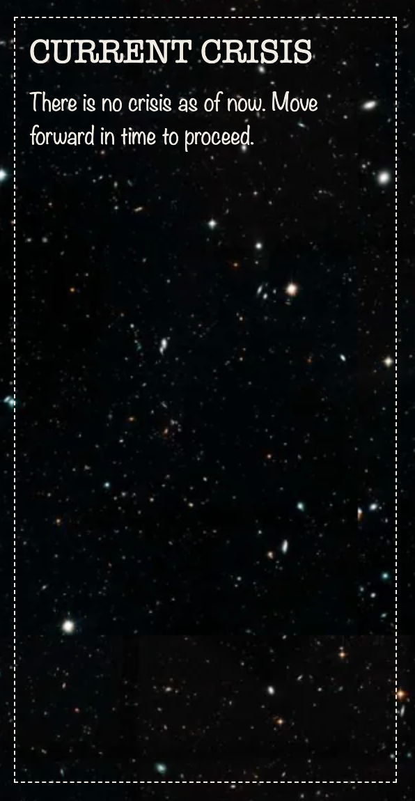

<h1>Through the Ages</h1>
An interactive web game meant to show the history of humans over time.

<h2>How to Play</h2>

- Open index.html (should lead to main starting page)

<h3>Paths & Pages</h3>
<ul>
    <li>index.html (introduction + instructions page)</li>
    <li>gameplay.html (actual game + ending page)</li>
</ul>

<h2>User Interface</h2>
<h3>Index.html -- Introduction page</h3>

<h3>gameplay.html -- Initial page layout</h3>

<h2>Subsections of gameplay.html</h2>
<h3>Current Information</h3>

Section meant to give user the information on the time period & events that occurred during that period for context.

<h3>Current Crisis</h3>
<table>
    <tr>
        <th>No crisis</th>
        <th>With crisis</th>
    </tr>
    <tr>
        <td></td>
        <td></td>
    </tr>
</table>

Occasionally occurring "crises" which will ask for the user's choice as to what to do. Most crisis choices will lead to a different ending.

<h3>History Log</h3>

Logs all the choices the user has made whenever a crisis has occurred.

<h3>Time Buttons</h3>
<table>
    <tr>
        <th>No crisis</th>
        <th>With crisis</th>
    </tr>
    <tr>
        <td></td>
        <td></td>
    </tr>
</table>

Controls whether to move forward in time or move back. When a crisis occurs, the move forward time is disabled as to force the user to make a choice before proceeding forward in time.

<h2>Endings</h2>

<h3>Ending #1: Death by Famine</h3>

<h3>Ending #2: Death by Disease</h3>

<h3>Ending #3: You died?!</h3>

<h3>Ending #4: Death by War</h3>

<h3>Ending #5: Death by Climate Change</h3>

<h3>Ending #6: You did it!!</h3>

<h2>Created with:</h2>

- HTML
- CSS
- JavaScript
- <a href="https://krita.org/en/">Krita</a> (for Art)
